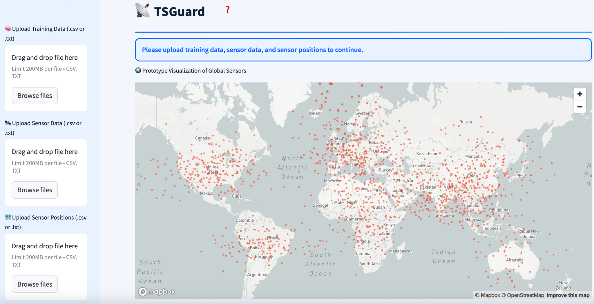
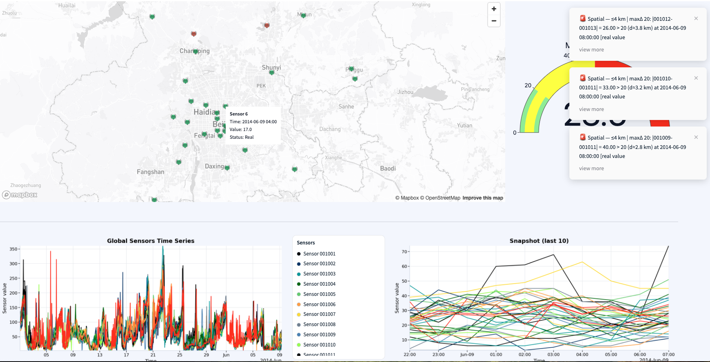
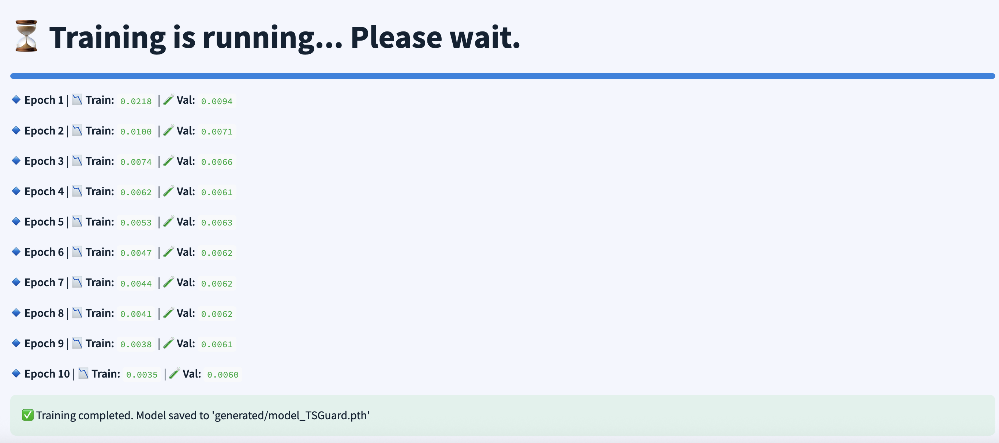
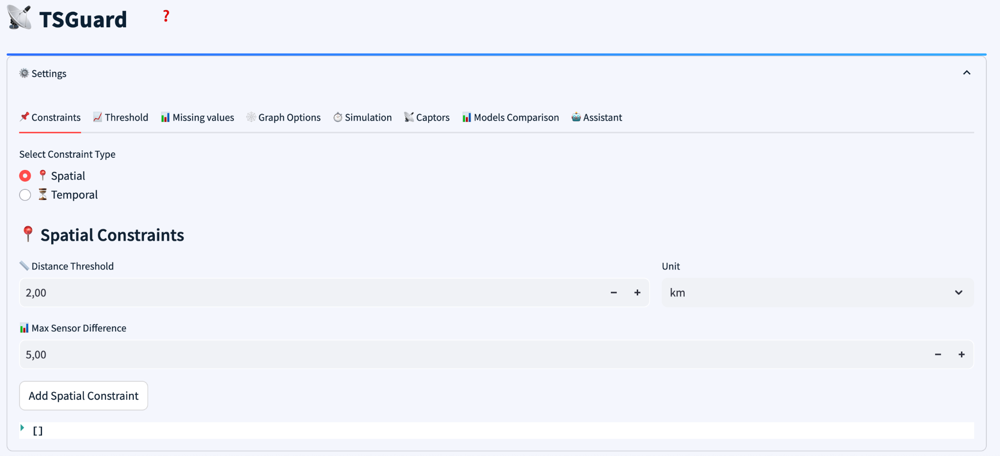
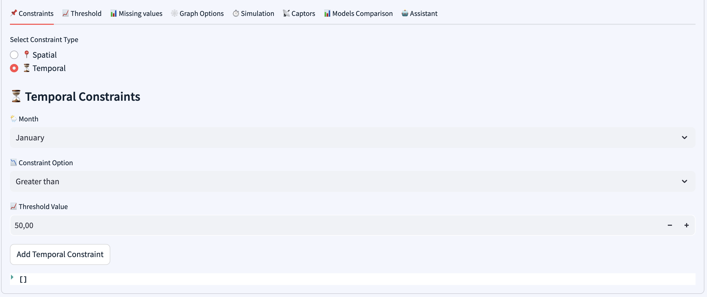
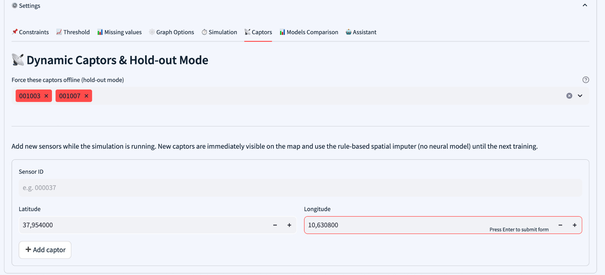
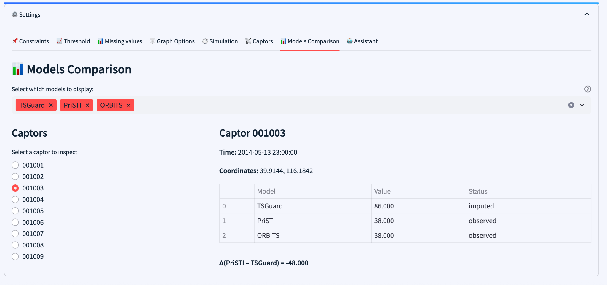
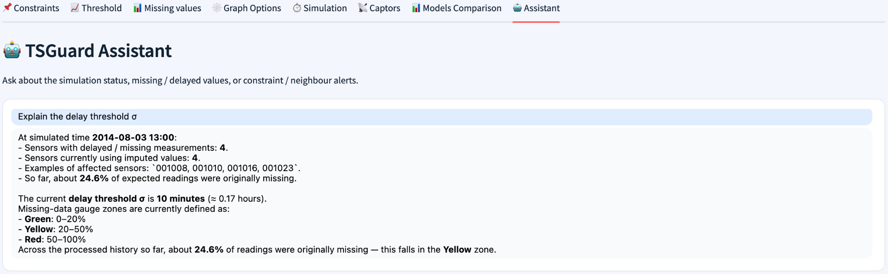

# TSGuard: Time-Series Guard for Real-Time Environmental Data Imputation

**Version:** 0.1  
**Last Updated:** 2025  
**License:** Apache-2.0

---

## Abstract

TSGuard is an advanced research framework designed for robust, real-time imputation of missing values in satellite-derived environmental time series data. The system addresses a critical challenge in environmental monitoring: maintaining data continuity when sensor networks experience failures, communication delays, or data gaps. TSGuard combines state-of-the-art deep learning architectures (Graph Convolutional Networks and Long Short-Term Memory networks) with domain-aware rule-based fallbacks to provide reliable, streaming imputation capabilities.

The framework is particularly well-suited for applications involving particulate matter (PM2.5) monitoring, air quality assessment, and other spatially-distributed environmental measurements where temporal continuity and spatial coherence are essential for accurate analysis and decision-making.

> **📚 For detailed technical documentation** including mathematical formulations, advanced usage examples, and comprehensive API reference, see [TECHNICAL.md](TECHNICAL.md).

---

## Table of Contents

1. [Key Features](#key-features)
2. [Architecture Overview](#architecture-overview)
3. [Methodology](#methodology)
4. [Installation](#installation)
5. [Quick Start Guide](#quick-start-guide)
6. [System Architecture](#system-architecture)
7. [Data Formats](#data-formats)
8. [Model Details](#model-details)
9. [Screenshots](#screenshots)
10. [Results](#results)
11. [Evaluation and Comparisons](#evaluation-and-comparisons)
12. [Configuration and Customization](#configuration-and-customization)
13. [Reproducibility](#reproducibility)
14. [Limitations and Considerations](#limitations-and-considerations)
15. [Contributors and Citation](#contributors-and-citation)

---

## Key Features

### Core Capabilities

- **🔗 Hybrid Spatio-Temporal Imputation**: Combines Graph Convolutional Networks (GCN) for spatial feature extraction with Long Short-Term Memory (LSTM) networks for temporal pattern learning, enabling accurate reconstruction of missing values based on both spatial relationships and historical patterns.

- **⚡ Real-Time Streaming Inference**: Designed for online deployment scenarios where data arrives continuously and imputation must occur in real-time with minimal latency.

- **🖥️ Interactive Web Interface**: Comprehensive Streamlit-based dashboard providing:
  - 📤 Data upload and validation
  - 📊 Real-time visualization of sensor networks and imputation results
  - 🎛️ Model training and simulation controls
  - 🔬 Comparative analysis with baseline methods (PriSTI, ORBIT)
  - ⚙️ Configurable constraint systems (spatial and temporal)
  - 🤖 AI-powered assistant for system guidance

- **🛡️ Domain-Aware Constraints**: Flexible constraint system supporting:
  - **📍 Spatial constraints**: Distance-based neighbor relationships and maximum sensor value differences
  - **⏰ Temporal constraints**: Month-specific thresholds and seasonal patterns
  - **✅ Range validation**: Automatic detection of out-of-range imputed values

- **📡 Dynamic Sensor Management**: Runtime addition of new sensors and hold-out mode for controlled ablation studies.

- **📈 Comprehensive Monitoring**: Real-time dashboards showing:
  - 📉 Missing value statistics and trends
  - 🎯 Imputation confidence metrics
  - ⚠️ Constraint violation alerts
  - 📊 Per-sensor performance analysis

### Technical Highlights

- **🏗️ Modular Architecture**: Clean separation between data processing, model training, inference, and visualization components
- **🔧 Robust Data Handling**: Automatic normalization of diverse timestamp formats, sensor ID canonicalization, and position data validation
- **🔬 Baseline Integration**: Built-in support for comparing against PriSTI (diffusion-based imputation) and ORBIT methods
- **📦 Reproducible Experiments**: Comprehensive artifact management including model checkpoints, scaler parameters, adjacency matrices, and configuration snapshots

---

## Architecture Overview

TSGuard follows a three-tier architecture:

1. **Presentation Layer** (`main_app.py`, `components/`): Streamlit-based user interface handling data upload, visualization, and user interactions
2. **Business Logic Layer** (`helpers.py`, `utils/`): Data preprocessing, normalization, state management, and configuration
3. **Model Layer** (`models/simulation_original.py`): Core machine learning components including GCN-LSTM architecture, training pipelines, and inference engines

### Component Structure

```
ts_guard/
├── main_app.py                    # Main Streamlit application entry point
├── components/                    # UI component modules
│   ├── sidebar.py                # File upload interface
│   ├── settings.py                # Configuration panels (constraints, thresholds, etc.)
│   ├── buttons.py                 # Action buttons (train, simulate)
│   ├── containers.py              # Visualization placeholders
│   └── chatbot.py                 # AI assistant interface
├── helpers.py                     # Data loading, normalization, state initialization
├── models/
│   └── simulation_original.py     # Core model implementation (GCN-LSTM, training, inference)
├── PRISTI/                        # PriSTI baseline integration
│   ├── main_model.py              # PriSTI diffusion model
│   ├── layers.py                  # Neural network layers
│   ├── dataset_*.py               # Dataset loaders for various domains
│   └── config/                    # Configuration files
├── utils/
│   └── config.py                  # Default configuration values
├── pm25/                          # Sample PM2.5 datasets
│   └── SampleData/                # Example ground truth, missing, and position files
├── generated/                     # Model artifacts (checkpoints, scalers, adjacency matrices)
├── orbits_results/                 # Archived ORBIT baseline outputs
├── outputs/                       # Runtime outputs (imputed data, metrics, audit logs)
└── requirements.txt               # Python dependencies
```

---

## Methodology

TSGuard addresses the challenge of reconstructing missing values in sensor network time series data by leveraging:

1. **Spatial dependencies**: Nearby sensors often exhibit correlated measurements due to shared environmental conditions
2. **Temporal patterns**: Historical observations at each sensor location provide predictive information
3. **Domain constraints**: Physical and statistical bounds on valid measurement values

### Model Architecture

TSGuard employs a hybrid GCN-LSTM architecture:

- **Spatial Processing (GCN)**: Graph Convolutional Network processes spatial relationships between sensors using adjacency matrices derived from geographic distances
- **Temporal Processing (LSTM)**: Long Short-Term Memory network captures temporal patterns in the sequence of spatial embeddings
- **Training**: Model is trained with masked MSE loss focusing on reconstructing missing values

> **For detailed mathematical formulations and architecture details**, see [TECHNICAL.md](TECHNICAL.md#mathematical-formulations). This ensures the model learns meaningful patterns for imputation.

### Inference Pipeline

During real-time inference, TSGuard follows a multi-stage process:

1. **Data Arrival**: New observations arrive for a subset of sensors at time t
2. **Missing Detection**: Identifies sensors with missing values beyond a configurable delay threshold (σ)
3. **Imputation Strategy Selection**:
   - **Scenario 1**: Data delayed but expected → wait for late arrival
   - **Scenario 2**: Neighbors available → use GCN-LSTM model
   - **Scenario 3**: No neighbors available → fallback to historical patterns or rule-based imputation
4. **Constraint Validation**: Checks imputed values against spatial and temporal constraints
5. **Alert Generation**: Raises alerts for constraint violations or anomalous patterns

---

## Installation

### Prerequisites

- 🐍 Python 3.10 or higher
- 📦 pip package manager
- 🚀 (Optional) CUDA-capable GPU for accelerated training (PyTorch with CUDA support)

### Step-by-Step Installation

1. **📥 Clone the repository**:
   ```bash
   git clone https://github.com/kaaaziz/ts_guard.git
   cd ts_guard
   ```

2. **🔧 Create a virtual environment** (recommended):
   ```bash
   python -m venv venv
   source venv/bin/activate  # On Windows: venv\Scripts\activate
   ```

3. **📚 Install dependencies**:
   ```bash
   pip install -r requirements.txt
   ```

4. **⚡ Install PyTorch** (if not included in requirements.txt):
   ```bash
   # For CPU-only (default)
   pip install torch torchvision torchaudio
   
   # For CUDA 11.8 (example - adjust for your CUDA version)
   pip install torch torchvision torchaudio --index-url https://download.pytorch.org/whl/cu118
   
   # For CUDA 12.1
   pip install torch torchvision torchaudio --index-url https://download.pytorch.org/whl/cu121
   ```

5. **✅ Verify installation**:
   ```bash
   python -c "import torch; import streamlit; import pandas; print('Installation successful')"
   ```

### System Requirements

- **💾 Minimum RAM**: 8 GB (16 GB recommended for large datasets)
- **💿 Disk Space**: ~2 GB for installation, additional space for data and model artifacts
- **🎮 GPU**: Optional but recommended for training on large datasets (NVIDIA GPU with CUDA support)

---

## Quick Start Guide

### Interactive Web Interface

1. **🚀 Launch the Streamlit application**:
   ```bash
   streamlit run main_app.py
   ```
   The application will open in your default web browser at `http://localhost:8501`

2. **📤 Upload Required Data Files** (via sidebar):
   - **📊 Training Data (Ground Truth)**: Complete time series with all sensor values
     - Format: CSV or TXT file
     - Required column: `datetime` (or `timestamp`, `date`, `time`)
     - Additional columns: One per sensor (sensor IDs as column names)
   
   - **📉 Sensor Data (Incomplete)**: Time series with missing values to be imputed
     - Same format as training data
     - Contains NaN or missing entries representing sensor failures or data gaps
   
   - **📍 Positions File**: Geographic coordinates for each sensor
     - Format: CSV file
     - Required columns: `sensor_id`, `latitude`, `longitude`
     - Alternative: Two-column format (longitude, latitude) with sensor IDs as index

3. **⚙️ Configure Settings** (expandable panel):
   - **📍 Constraints**: Define spatial (distance thresholds) and temporal (month-specific) constraints
   - **📊 Thresholds**: Set delay thresholds (σ) for missing value detection
   - **🕸️ Graph Options**: Configure graph size and adjacency parameters
   - **⏱️ Simulation**: Adjust simulation speed and replay parameters
   - **📡 Captors**: Add dynamic sensors or force sensors offline for testing

4. **🧠 Train the Model**:
   - Click **"🧠 Start TSGuard training"**
   - Training progress will be displayed
   - Model artifacts will be saved to `generated/` directory

5. **▶️ Run Simulation**:
   - Click **"▶️ Start TSGuard Simulation"**
   - Real-time visualization will show:
     - 🗺️ Interactive map with sensor locations and status
     - 📊 Missing value gauge (system health indicator)
     - 📈 Time series charts with imputed values highlighted
   - Access **Settings → Models Comparison** to compare TSGuard with baseline methods

### Example Workflow

```python
# Basic programmatic usage
from models.simulation_original import train_model
import pandas as pd

# Load data
training_data = pd.read_csv("pm25/SampleData/pm25_ground.txt")
sensor_data = pd.read_csv("pm25/SampleData/pm25_missing.txt")
positions = pd.read_csv("pm25/SampleData/pm25_latlng.txt")

# Train model
model = train_model(
    tr=training_data,
    df=sensor_data,
    pf=positions,
    epochs=20,
    model_path="generated/model_TSGuard.pth"
)
```

> **For advanced usage examples, custom configurations, and API reference**, see [TECHNICAL.md](TECHNICAL.md#advanced-usage).

---

## System Architecture

### Data Flow

```
📥 User Input (CSV/TXT files)
    ↓
🔧 Data Loading & Normalization (helpers.py)
    ↓
📊 State Initialization (session_state)
    ↓
┌─────────────────┬─────────────────┐
│  🧠 Training Path  │  ⚡ Inference Path  │
└─────────────────┴─────────────────┘
    ↓                    ↓
🎓 Model Training      🔄 Real-Time Simulation
(GCN-LSTM)          (Streaming Imputation)
    ↓                    ↓
💾 Model Checkpoint    📊 Visualization & Logging
(generated/)        (outputs/, session_state)
```

### Key Components

#### 1. 📥 Data Processing Pipeline (`helpers.py`)

- **`load_training_data()`**: Loads and validates ground truth time series
- **`load_sensor_data()`**: Handles incomplete sensor data with flexible datetime parsing
- **`load_positions_data()`**: Processes geographic coordinates
- **`normalize_df_columns()`**: Canonicalizes sensor IDs (zero-padding, string normalization)
- **`normalize_positions_df()`**: Standardizes position data formats
- **`init_files()`**: Orchestrates data loading and alignment

#### 2. 🧠 Model Implementation (`models/simulation_original.py`)

- **`GraphConvolution`**: Graph convolutional layer for spatial feature extraction
- **`GCNLSTMImputer`**: Main model class combining GCN and LSTM
- **`SpatioTemporalDataset`**: PyTorch Dataset for training with sliding windows
- **`train_model()`**: Training pipeline with validation splits and checkpointing
- **`run_simulation_with_live_imputation()`**: Real-time inference with visualization
- **`create_adjacency_matrix()`**: Spatial relationship computation
- **`impute_window_with_pristi()`**: PriSTI baseline integration

#### 3. 🖥️ User Interface (`components/`)

- **`sidebar.py`**: File upload interface with validation
- **`settings.py`**: Comprehensive configuration panels
- **`buttons.py`**: Action triggers for training and simulation
- **`containers.py`**: Placeholder management for dynamic visualizations
- **`chatbot.py`**: AI assistant for system guidance and troubleshooting

---

## Data Formats

TSGuard requires three input files:

1. **📊 Training Data (Ground Truth)**: CSV or TXT with complete time series
   - Column: `datetime` (or `timestamp`, `date`, `time`)
   - Additional columns: One per sensor (sensor IDs as column names)

2. **📉 Sensor Data (Incomplete)**: CSV or TXT with missing values
   - Same structure as training data
   - Contains NaN entries representing missing data

3. **📍 Positions File**: CSV with sensor coordinates
   - Columns: `sensor_id`, `latitude`, `longitude`

> **📚 For detailed file format specifications, examples, and validation requirements**, see [TECHNICAL.md](TECHNICAL.md#detailed-input-requirements).

---

## Model Details

### Hyperparameters

Default configuration (configurable via `utils/config.py`):

- **📏 Sequence Length**: 36 time steps (configurable via `seq_len` parameter)
- **🔗 GCN Hidden Dimension**: 64 (configurable)
- **🔄 LSTM Hidden Dimension**: 128 (configurable)
- **📈 Learning Rate**: 1e-3 (Adam optimizer)
- **📦 Batch Size**: 32
- **🎲 Dropout**: 0.1 (both GCN and LSTM)
- **🔄 Training Epochs**: 20 (default, configurable)
- **🕸️ Adjacency Kernel**: Gaussian with σ² = 0.1 × std(distance)²

### Training Process

1. **✂️ Data Splitting**: Temporal split by months (train: Jan, Feb, Apr, May, Jul, Aug, Oct; validation: Mar, Jun, Sep, Dec)
2. **📊 Normalization**: Min-max scaling per sensor based on training data statistics
3. **🪟 Window Generation**: Sliding windows of length `seq_len` with next-step prediction targets
4. **📉 Loss Computation**: Masked MSE focusing only on originally missing positions
5. **💾 Checkpointing**: Saves model weights, scaler parameters, and adjacency matrix

### Inference Modes

- **📦 Batch Inference**: Process entire time series at once (faster, requires full data)
- **⚡ Streaming Inference**: Process one timestamp at a time (real-time, lower memory)

---

## Screenshots

### Data Upload Interface



The sidebar provides an intuitive interface for uploading training data, sensor data with missing values, and sensor position files.

### Global Sensors Map



Interactive visualization of sensor network locations with real-time status indicators.

### Training Interface



Model training interface showing progress and configuration options.

### Spatial Constraints Configuration



Configure spatial constraints including distance thresholds and maximum sensor value differences.

### Temporal Constraints Configuration



Set up temporal constraints with month-specific thresholds and seasonal patterns.

### Dynamic Captors Management



Add new sensors at runtime and manage sensor network configuration dynamically.

### Models Comparison



Compare TSGuard imputation results with baseline methods (PriSTI, ORBIT) side-by-side.

### TSGuard Assistant



AI-powered assistant providing system guidance and troubleshooting support.

---

## Results

TSGuard has been evaluated on PM2.5 air quality monitoring datasets with promising results. The system demonstrates:

- **🎯 High Imputation Accuracy**: Effective reconstruction of missing values using spatial and temporal patterns
- **⚡ Real-Time Performance**: Streaming inference capabilities suitable for online deployment
- **🛡️ Robust Constraint Validation**: Automatic detection of out-of-range values and constraint violations
- **📊 Comparative Performance**: Competitive results compared to baseline methods (PriSTI, ORBIT)

### Key Performance Metrics

- **📈 Per-sensor imputation accuracy**: Tracked via MSE, MAE, and RMSE metrics
- **🌐 Global statistics**: Overall missing value percentage and imputation coverage
- **⚠️ Constraint violations**: Count and severity of out-of-range predictions
- **📉 Temporal consistency**: Smoothness and continuity of imputed sequences

### Output Files

Detailed results and metrics are available in the `outputs/` directory after running simulations, including:
- 📄 `outputs/imputed.csv`: Complete imputed time series
- 📊 `outputs/metrics_by_sensor.csv`: Per-sensor performance metrics
- 📝 `outputs/audit.csv`: System events and decision logs
- 🎯 `outputs/confidence.csv`: Imputation confidence scores

---

## Evaluation and Comparisons

### Performance Results

TSGuard has been evaluated against state-of-the-art baseline methods on PM2.5 air quality monitoring datasets. The results demonstrate superior imputation accuracy while maintaining competitive inference speed.

| Model                         | MAE ↓     | RMSE ↓    | Inference Speed ↑ |
| ----------------------------- | --------- | --------- | ----------------- |
| PriSTI-ON                     | 75.23     | 111.67    | 0.01              |
| ORBITS (Khayati et al., 2020) | 18.16     | 29.35     | **1.2**           |
| **TSGuard (ours)**            | **16.13** | **28.37** | 1.0               |

✅ **Best overall accuracy:** TSGuard  
✅ **Fastest inference:** ORBITS

TSGuard significantly outperforms the baseline methods in real-time imputation accuracy, achieving **11.2% lower MAE** and **3.3% lower RMSE** compared to ORBITS, while maintaining near real-time inference performance suitable for streaming applications.

### Built-in Baselines

TSGuard includes integration with two baseline methods:

1. **🔬 PriSTI** (Prior-informed Spatio-Temporal Imputation):
   - Diffusion-based generative model
   - Requires separate model artifacts in `PRISTI/save/`
   - Accessible via Settings → Models Comparison

2. **📊 ORBIT**:
   - Archived results in `orbits_results/`
   - Used for retrospective comparison studies

### Comparison Metrics

The system tracks comprehensive performance metrics:

- **📈 Per-sensor imputation accuracy**: MSE, MAE, RMSE
- **🌐 Global statistics**: Overall missing value percentage, imputation coverage
- **⚠️ Constraint violations**: Count and severity of out-of-range predictions
- **📉 Temporal consistency**: Smoothness of imputed sequences

### Visualization Tools

- **🗺️ Interactive Maps**: Real-time sensor status and imputation results (PyDeck)
- **📊 Time Series Charts**: Plotly-based visualization with imputed values highlighted
- **📋 Comparison Tables**: Side-by-side model outputs per sensor
- **⚡ System Health Gauge**: Visual indicator of missing value percentage

---

### Customization Points

1. **Model Architecture**: Modify `GCNLSTMImputer` class in `models/simulation_original.py`
2. **Adjacency Computation**: Adjust `create_adjacency_matrix()` for different spatial kernels
3. **Loss Function**: Customize `masked_loss()` for different objectives
4. **UI Components**: Extend `components/` modules for additional features
5. **Data Loaders**: Adapt `helpers.py` for different data sources

---

## Reproducibility

### Artifact Management

TSGuard saves comprehensive artifacts for reproducibility:

- **💾 Model Checkpoints**: `generated/model_TSGuard.pth` (PyTorch state dict)
- **📊 Scaler Parameters**: `generated/model_TSGuard_scaler.json` (min/max values per sensor)
- **🕸️ Adjacency Matrix**: `generated/model_TSGuard_adjacency.json` (spatial relationships)
- **⚙️ Configuration**: `generated/model_TSGuard_imputer_config.json` (hyperparameters)

### Experiment Tracking

- **📝 Imputation Logs**: `tsguard_imputations.csv` (timestamped imputation records)
- **📋 Audit Trail**: `outputs/audit.csv` (system events and decisions)
- **📈 Metrics**: `outputs/metrics_by_sensor.csv` (per-sensor performance)

### Version Control Recommendations

- ✅ Commit configuration files (`utils/config.py`)
- 📝 Track model architectures (code changes)
- 📚 Document data preprocessing steps
- 🎲 Save random seeds if using stochastic components

---

## Contributors and Citation

### Primary Contributors

- **Imane Hocine** — `imane.hocine@uni.lu`  
  Interdisciplinary Centre for Security, Reliability and Trust (SnT), University of Luxembourg

- **Asma Abboura** — `a.abboura@univ-chlef.dz`  
  Hassiba Ben Bouali University, Chlef, Algeria

- **Abhijith Senthilkumar** — `abhijith.senthilkumar@uni.lu`  
  Interdisciplinary Centre for Security, Reliability and Trust (SnT), University of Luxembourg

### Affiliations

- University of Luxembourg (SnT)
- Hassiba Ben Bouali University, Chlef
- Université de Paris
- École Nationale Supérieure d'Informatique (ESI)

### Citation

If you use TSGuard in your research, please cite:

```bibtex
@software{tsguard2025,
  title={TSGuard: Time-Series Guard for Real-Time Environmental Data Imputation},
  author={Hocine, Imane and Abboura, Asma and Senthilkumar, Abhijith},
  year={2025},
  version={0.1},
  license={Apache-2.0},
  url={https://github.com/your-repo/tsguard}
}
```
---

## Contact and Support

For questions, bug reports, feature requests, or collaboration inquiries:

- **Email**: Contact individual contributors listed above
- **Issues**: Use the GitHub issue tracker (if repository is public)
- **Documentation**: Refer to inline code documentation and this README

---

## License

This project is licensed under the Apache License 2.0. See LICENSE file for details.

---

## Acknowledgments

The development of TSGuard was supported by research collaborations between the University of Luxembourg, Hassiba Ben Bouali University, and Université de Paris. We thank the open-source community for the excellent tools and libraries that made this project possible.

---

**Last Updated**: January 2025  
**Maintained by**: TSGuard Development Team
