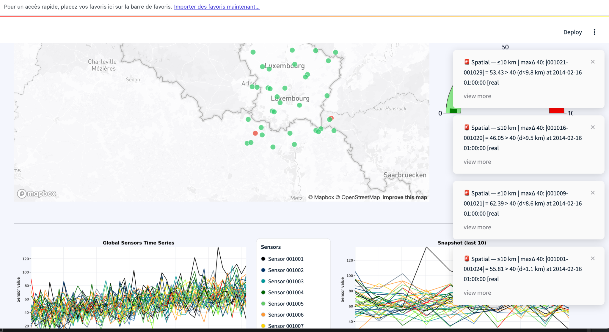

# TSGuard: Time-Series Guard for Data Imputation in Satellite Data

## 📌 Project Overview

TSGuard is an advanced AI-driven framework for imputing missing time-series data in satellite observations. It leverages Graph Neural Networks (GNNs), streaming inference, and statistical methods to enhance the accuracy of satellite-based environmental monitoring, with a focus on PM2.5 data.

The **`updated_tsguard`** branch introduces a refactored Streamlit interface (`main_app.py`), a modular UI component architecture (`components/`), and a clearer integration with the **PriSTI** baseline (`models/PRISTI` and `PRISTI/`). The imputation with **ORBIT** has been done offline and the results are saved under (`orbits_results`) which are then read into a dataframe inside (`simulation_original.py`).

---

## 🛠️ Features

✅ **AI-Powered Data Imputation**
Uses GNN-based and other ML/DL techniques to fill in missing points in satellite-derived time series.

✅ **Interactive Web App (Streamlit)**
`main_app.py` exposes a Streamlit interface for uploading data, configuring constraints, and visualizing results.

✅ **Chat & Guided Experience (Chatbot)**
A chatbot component (`components/chatbot.py`) helps guide the user through configuration and interpretation of results.

✅ **Structured UI Components**
Reusable UI building blocks (`buttons`, `containers`, `settings`, `sidebar`) make the app easier to extend.

✅ **Simulation & Baseline Comparison**
Simulation tools (`models/simulation_original.py`) and PriSTI integration (`models/PRISTI/`, `PRISTI/`) allow side‑by‑side evaluation.

✅ **Sample Data Included**
Ready-to-use PM2.5 sample files under `pm25/SampleData/` for quick demo and testing.

---

## 📖 How It Works

TSGuard processes time-series satellite (e.g., PM2.5) data by:

1. **Detecting missing values** 🔍
   Parses uploaded time series and locates NaNs/gaps per sensor.

2. **Applying ML/DL imputation techniques** 📊
   Uses graph-based and time-series models to estimate missing values, considering spatial/temporal neighborhoods and constraints.

3. **Generating accurate reconstructions** ✅
   Produces imputed series (e.g., `pm25_imputed_TSGuard.csv`) and optionally exports them for downstream tasks.

4. **Visualizing and validating results** 📈
   The Streamlit app displays:

   * Time-series plots (original vs imputed)
   * Spatial maps (sensor positions, constraints)
   * Comparison dashboards vs PriSTI

---

## 📊 Screenshots (UI Overview)

This section provides a visual overview of the main functionalities of TSGuard. It is recommended to place the images inside an `images/screenshots/` directory.

### 🌍 Global Sensors Map & Real-Time Alerts




---

### ⚙️ Spatial Constraints Configuration


---

### ⏳ Temporal Constraints Configuration


---

### 📡 Dynamic Captors & Hold-Out Mode


---

### 📊 Models Comparison (TSGuard vs PriSTI vs ORBITS)


---

### 🤖 TSGuard Assistant – Delay & Missing Data Analysis


---

### 🧪 Training & Data Upload Interface


---

## 📂 Project Structure (updated_tsguard)

```text
TSGuard/
├── components/
│   ├── buttons.py
│   ├── chatbot.py
│   ├── containers.py
│   ├── settings.py
│   └── sidebar.py
├── helpers.py
├── images/
├── main_app.py
├── models/
│   ├── PRISTI/
│   └── simulation_original.py
├── orbits_results/
├── pm25/
│   ├── pm25_meanstd.pk
│   └── SampleData/
├── PRISTI/
├── README.md
├── requirements.txt
└── utils/
    └── config.py
```

---

## 🚀 Installation & Setup

```bash
git clone https://github.com/ImaneHCN/TSGuard.git
cd TSGuard
git checkout updated_tsguard

git submodule update --init --recursive

python -m venv venv
source venv/bin/activate  # Linux/Mac
# or venv\\Scripts\\activate  # Windows

pip install -r requirements.txt
```

---

## ▶️ Running the Application

```bash
streamlit run main_app.py
```

Then open [http://localhost:8501](http://localhost:8501).

---

## 📊 Model Performance Summary

| Model                         | MAE ↓     | RMSE ↓    | Inference Speed ↑ |
| ----------------------------- | --------- | --------- | ----------------- |
| PriSTI-ON                     | 75.23     | 111.67    | 0.01              |
| ORBITS (Khayati et al., 2020) | 18.16     | 29.35     | **1.2**           |
| **TSGuard (ours)**            | **16.13** | **28.37** | 1.0               |

✅ **Best overall accuracy:** TSGuard
✅ **Fastest inference:** ORBITS

TSGuard significantly outperforms the baseline methods in real-time imputation accuracy.

---

## 🤝 Contributing

Contributions targeting this branch are welcome.

```bash
git checkout updated_tsguard
git checkout -b feature/my-feature
# commit & push
```

---

## 📄 License

Copyright (c) 2025 TSGuard Contributors

---

## 📧 Contact

Maintainer: Imane HCN
Repository: [https://github.com/kaaaziz/ts\_guard](https://github.com/ImaneHCN/TSGuard)
